  

  

   

  
  
  
  

<!-- Animated-ish Divider -->

  

<!-- About Me Section -->
<h2 align="center">
  
  About Me
  
</h2>

  

 

  <table border="0">
    <tr>
      <td width="65%" valign="top">
        <ul>
          <li>👤 <b>Name:</b> Lawal Olayinka Awal — <i>aka Ayinkx</i></li>
          <li>🔭 <b>Currently:</b> Contributing to Open Source projects</li>
          <li>🌱 <b>Learning:</b> Flask, Flask API, HTML, CSS, Docker &amp; SQL</li>
          <li>🐍 <b>Focus:</b> Python, Backend Development, Automation &amp; Open Source</li>
          <li>🎧 <b>Also:</b> Nigerian Musician, Producer &amp; Content Creator (<a href="https://www.instagram.com/ayinkxreacts">@ayinkxreacts</a>)</li>
          <li>💡 <b>Passion:</b> Building real-world apps that solve problems</li>
          <li>🤝 <b>Open to:</b> Collaborate on Python &amp; Open Source projects</li>
          <li>📚 <b>Style:</b> Self-taught, learn-by-building approach</li>
          <li>⚡ <b>Goal:</b> Build reliable software that solves real-world problems.</li>
        </ul>
      </td>
      <td width="35%" align="center">
        
          
        
        <b>Code. Build. Repeat.</b>
        
      </td>
    </tr>
  </table>

 

  

<!-- Tech Stack -->
<h2 align="center">
  
  Tech Stack &amp; Tools
  
</h2>

  

<!-- Floating Tech Icons -->

  
  
  
  
  
  
  

 

<!-- Core Skills -->
<h3 align="center">Core Skills</h3>

<pre>
Python        ██████████████████░░░  90%
Flask &amp; REST  █████████████████░░░░  85%
HTML &amp; CSS    ███████████████░░░░░░  75%
SQL           ████████████░░░░░░░░░  60%
Docker        ███████████░░░░░░░░░░  55%
Markdown      ███████████████████░░  95%
</pre>

 

  

<!-- GitHub Stats -->
<h2 align="center">
  
  GitHub Stats
  
</h2>

<!-- Quick stats - shields.io is always reliable -->

  <table>
    <tr>
      <td></td>
      <td></td>
      <td></td>
      <td></td>
    </tr>
  </table>

 

<!-- Local cards generated by GitHub Actions (always online) -->

  
  

 

<!-- Streak Stats -->

  

 

<!-- Achievements -->

  <h2>
    
    GitHub Achievements
    
  </h2>
  

 

  

<!-- Contribution Graph -->

  <h2>
    
    Contribution Graph
    
  </h2>
  

 

<!-- Activity Graph (the classic one) -->

  <h2>
    
    Activity Graph
    
  </h2>
  

 

<!-- Contribution Snake -->
<h2 align="center">
  
  Contribution Snake
  
</h2>

  <picture>
    <source media="(prefers-color-scheme: dark)" srcset="https://raw.githubusercontent.com/Ayinkx/Ayinkx/output/github-contribution-grid-snake-dark.svg"/>
    <source media="(prefers-color-scheme: light)" srcset="https://raw.githubusercontent.com/Ayinkx/Ayinkx/output/github-contribution-grid-snake.svg"/>
    
  </picture>

 

  

 

<!-- Featured Projects -->
<h2 align="center">
  
  Featured Projects
  
</h2>

  <table>
    <tr>
      <td align="center" width="50%">
        
         
        <b>🚀 Flask REST API Boilerplate</b>
         
        Minimal, tested starting point for Flask REST APIs with pytest
      </td>
      <td align="center" width="50%">
        
         
        <b>✅ Todo CLI</b>
         
        Dependency-free command-line todo list in pure Python
      </td>
    </tr>
  </table>

 

<!-- Music & Content -->
<h2 align="center">
  
  Music &amp; Content
  
</h2>

  Beyond code, I create as <b>Ayinkx</b> — a Nigerian <b>musician, producer</b> and <b>content creator</b>. 
  Love songs, chill vibes and real stories. 🎧⚡

  <table>
    <tr>
      <td align="center" width="50%">
        <h3>🎧 Music</h3>
        Love songs · chill vibes · real stories
          
        
        
        
          
        
        
        
         
        
        
      </td>
      <td align="center" width="50%">
        <h3>⚡ Content Creation</h3>
        Viral reactions · live streams · community
          
        
        
          
        
        
         
        
        
      </td>
    </tr>
  </table>

 

  

 

<!-- Developer Vibe -->
<h2 align="center">
  
  Developer Vibe
  
</h2>

  

 

  <table>
    <tr>
      <td align="center" width="33%">
         
        <b>🚀 Building Projects</b>
      </td>
      <td align="center" width="33%">
         
        <b>🌍 Open Source</b>
      </td>
      <td align="center" width="33%">
         
        <b>🧩 Learning Daily</b>
      </td>
    </tr>
  </table>

 

  <table>
    <tr>
      <td>🚀 Building real-world Python projects</td>
      <td>🌍 Contributing to Open Source</td>
    </tr>
    <tr>
      <td>🧩 Strengthening Backend skills</td>
      <td>🐳 Learning Docker</td>
    </tr>
    <tr>
      <td>🌐 Improving Flask &amp; REST APIs</td>
      <td>📖 Preparing to learn SQL</td>
    </tr>
  </table>

 

<!-- Developer Philosophy -->

  
<b><h2>📌 Developer Philosophy</h2></b>

   
  

    <table border="0" width="80%">
      <tr>
        <td align="center">
          
        </td>
        <td>
          <blockquote>
            <b><i>"Every contribution, no matter how small, is another step toward becoming a better software engineer."</i></b>
             
            — Ayinkx
          </blockquote>
        </td>
        <td align="center">
          
        </td>
      </tr>
    </table>
     
    
  

 

  

 

<!-- Connect With Me -->
<h2 align="center">
  
  Connect With Me
  
</h2>

  
  
  
  
   
  
  
  
  
   
  
  
  
  

 

  

 

<!-- Support Section -->
<h2 align="center">
  
  Support My Work
  
</h2>

  
  
  

 

<!-- Live Visitor Counter -->
<h2 align="center">
  
  Live Visitor Counter
  
</h2>

  <table>
    <tr>
      <td align="center"><b>👀 Profile Views</b></td>
      <td align="center"><b>👥 Followers</b></td>
      <td align="center"><b>⭐ Total Stars</b></td>
      <td align="center"><b>📦 Public Repos</b></td>
    </tr>
    <tr>
      <td></td>
      <td></td>
      <td></td>
      <td></td>
    </tr>
  </table>

 

<!-- Latest Activity -->
<h2 align="center">
  
  Latest Activity
  
</h2>

  

 

  

 

<!-- Footer -->

  

    

  
  
  
  

    

  

    

  

    

  

    

  ⭐ From Ayinkx with ❤️ and 🐍

