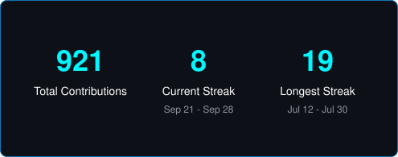

  

  

   

  
  
  
  

  

<h2 align="center">🧭 About Me</h2>

  

  <table border="0">
    <tr>
      <td width="65%" valign="top">
        <ul>
          <li>👤 <b>Name:</b> Lawal Olayinka Awal — <i>aka Ayinkx</i></li>
          <li>🚀 <b>Building:</b> <a href="https://social-autopilots.vercel.app"><b>Social Autopilot</b></a> — a live multi-platform publishing SaaS</li>
          <li>🔭 <b>Currently:</b> Contributing to Open Source projects</li>
          <li>🌱 <b>Learning:</b> FastAPI, PostgreSQL, OAuth, Docker &amp; CI/CD</li>
          <li>🐍 <b>Focus:</b> Python, Backend Development, APIs, Automation &amp; Open Source</li>
          <li>🎧 <b>Also:</b> Nigerian Musician, Producer &amp; Content Creator (<a href="https://www.instagram.com/ayinkxreacts">@ayinkxreacts</a>)</li>
          <li>💡 <b>Passion:</b> Building real-world apps that solve problems</li>
          <li>🤝 <b>Open to:</b> Backend / Python roles &amp; Open Source collaboration</li>
          <li>📚 <b>Style:</b> Self-taught, learn-by-building approach</li>
          <li>🔗 <b>Portfolio:</b> <a href="https://ayinkx-portfolio.vercel.app">ayinkx-portfolio.vercel.app</a></li>
        </ul>
      </td>
      <td width="35%" align="center">
        
          
        
        <b>Code. Build. Repeat.</b>
        
      </td>
    </tr>
  </table>

  

<h2 align="center">🧰 Tech Stack &amp; Tools</h2>

  

<pre>
Python             ██████████████████░░░  90%
FastAPI &amp; REST     █████████████████░░░░  85%
Testing (pytest)   ████████████████░░░░░  82%
SQL / PostgreSQL   ████████████████░░░░░  80%
HTML &amp; CSS         ███████████████░░░░░░  75%
Docker &amp; CI/CD     ██████████████░░░░░░░  70%
</pre>

  
  
  
  
  
  
  

  

<h2 align="center">📊 GitHub Stats</h2>

  <table>
    <tr>
      <td></td>
      <td></td>
      <td></td>
      <td></td>
    </tr>
  </table>

  
  

  

  <h3 align="center">🏆 Achievements</h3>
  

  

<h2 align="center">🌌 Contribution Activity</h2>

  

  

  <picture>
    <source media="(prefers-color-scheme: dark)" srcset="https://raw.githubusercontent.com/Ayinkx/Ayinkx/output/github-contribution-grid-snake-dark.svg"/>
    <source media="(prefers-color-scheme: light)" srcset="https://raw.githubusercontent.com/Ayinkx/Ayinkx/output/github-contribution-grid-snake.svg"/>
    
  </picture>

  

<h2 align="center">🚀 Featured Projects</h2>

  <table>
    <tr>
      <td align="center">
        <h3>🚀 Social Autopilot </h3>
        One post, every platform. Multi-account publishing SaaS for YouTube, TikTok, Facebook, Instagram, Threads, LinkedIn &amp; X — scheduling, recurring posts, team workspaces and 360+ tests.
         
        <b>FastAPI · PostgreSQL · Supabase · OAuth · Vercel</b>
          
        
        
        
      </td>
    </tr>
  </table>

  <table>
    <tr>
      <td align="center" width="50%">
        
         
        <b>🚀 Flask REST API Boilerplate</b>
         
        Minimal, tested starting point for Flask REST APIs with pytest
      </td>
      <td align="center" width="50%">
        
         
        <b>✅ Todo CLI</b>
         
        Dependency-free command-line todo list in pure Python
      </td>
    </tr>
  </table>

  

<h2 align="center">🎧 Music &amp; Content</h2>

  Beyond code, I create as <b>Ayinkx</b> — a Nigerian <b>musician, producer</b> and <b>content creator</b>. 
  Love songs, chill vibes and real stories. 🎧⚡

  <table>
    <tr>
      <td align="center" width="50%">
        <h3>🎧 Music</h3>
        Love songs · chill vibes · real stories
          
        
        
        
          
        
        
        
         
        
        
      </td>
      <td align="center" width="50%">
        <h3>⚡ Content Creation</h3>
        Viral reactions · live streams · community
          
        
        
          
        
        
         
        
        
      </td>
    </tr>
  </table>

  

<h2 align="center">💬 What Collaborators Say</h2>

  <table>
    <tr>
      <td width="33%" valign="top">
        <blockquote>
          <i>"merged, thanks for the thorough coverage here — the stored-vs-system resolution cases and the
          outside-provider guard test were exactly the gaps described. nice work matching the existing
          mocking patterns."</i>
        </blockquote>
        <a href="https://github.com/AnchorNet-Org/AnchorNet-Frontend/pull/272#issuecomment-5035011323"><b>Jagadeeshftw</b> · Maintainer, AnchorNet</a>
      </td>
      <td width="33%" valign="top">
        <blockquote>
          <i>"Clean fix, exactly what the issue asked for… documenting the decision in CONTRIBUTING.md is a
          nice touch most contributors would have skipped. Thanks for taking this on."</i>
        </blockquote>
        <a href="https://github.com/drydocs/meridian/pull/397"><b>collinsezedike</b> · Maintainer, Meridian</a>
      </td>
      <td width="33%" valign="top">
        <blockquote>
          <i>"Thanks — this is solid work, and the guards around payee verification and wallet status are
          the right ones."</i>
        </blockquote>
        <a href="https://github.com/milepost-labs/milepost/pull/60#issuecomment-5411824158"><b>Gbemi-programmer</b> · Maintainer, Milepost</a>
      </td>
    </tr>
  </table>
  Real comments from maintainers on my pull requests — each links to the original on GitHub.

  

<h2 align="center">🧑‍💻 Developer Vibe</h2>

  

 

  <table>
    <tr>
      <td align="center" width="33%">
         
        <b>🚀 Building Projects</b>
      </td>
      <td align="center" width="33%">
         
        <b>🌍 Open Source</b>
      </td>
      <td align="center" width="33%">
         
        <b>🧩 Learning Daily</b>
      </td>
    </tr>
  </table>

 

  <table>
    <tr>
      <td>🚀 Shipping a live SaaS (Social Autopilot)</td>
      <td>🌍 Contributing to Open Source</td>
    </tr>
    <tr>
      <td>🧩 Building reliable backends (FastAPI · PostgreSQL)</td>
      <td>🐳 Docker &amp; CI/CD</td>
    </tr>
    <tr>
      <td>🌐 Designing REST APIs &amp; OAuth integrations</td>
      <td>🧪 Writing tests that let me refactor</td>
    </tr>
  </table>

 

  
<b>📌 Developer Philosophy</b>

   
  

    <table border="0" width="80%">
      <tr>
        <td align="center">
          
        </td>
        <td>
          <blockquote>
            <b><i>"Every contribution, no matter how small, is another step toward becoming a better software engineer."</i></b>
             
            — Ayinkx
          </blockquote>
        </td>
        <td align="center">
          
        </td>
      </tr>
    </table>
     
    
  

  

<h2 align="center">🤝 Connect With Me</h2>

  
  
  
  
  
  
   
  
  
  
  
  
   
  
  
  
  

  

<h2 align="center">☕ Support My Work</h2>

  
  
  

  

<h2 align="center">📈 Latest Activity</h2>

  

 

  <table>
    <tr>
      <td align="center"><b>👀 Profile Views</b></td>
      <td align="center"><b>👥 Followers</b></td>
      <td align="center"><b>⭐ Total Stars</b></td>
      <td align="center"><b>📦 Public Repos</b></td>
    </tr>
    <tr>
      <td></td>
      <td></td>
      <td></td>
      <td></td>
    </tr>
  </table>

 

  

    

  

    

  

    

  ⭐ From Ayinkx with ❤️ and 🐍

